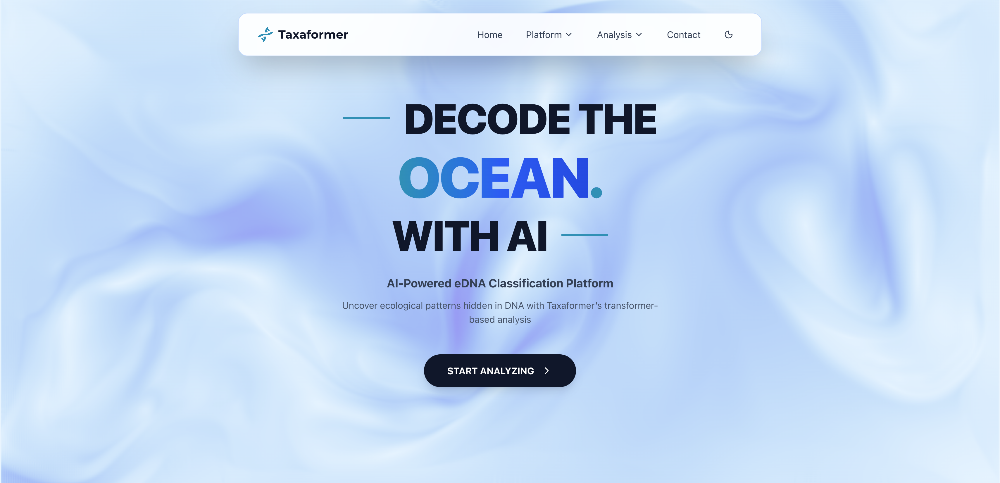
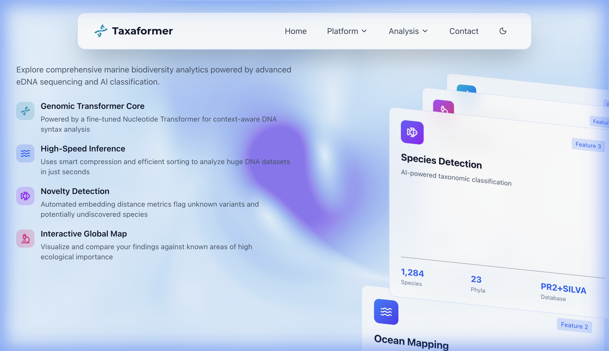
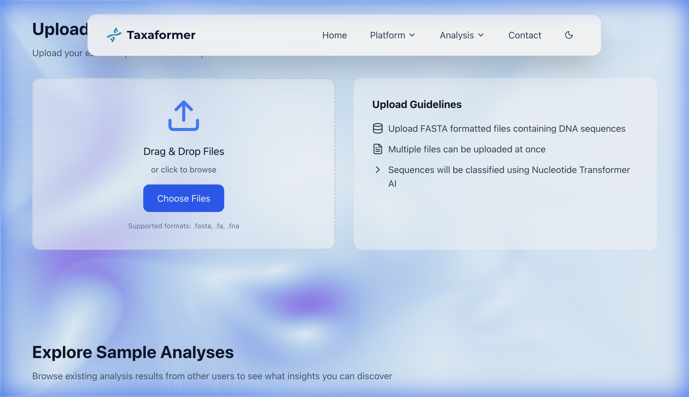
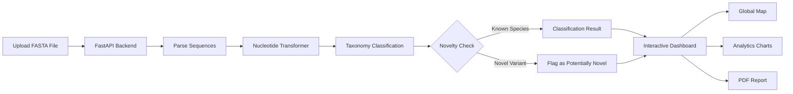

<p align="center">
  
</p>

<h1 align="center">TaxaFormer</h1>

<p align="center">
  <strong>AI-Powered eDNA Classification Platform for Marine Biodiversity</strong>
</p>

<p align="center">
  <em>Transform environmental DNA sequences into biodiversity insights using the Nucleotide Transformer</em>
</p>

<p align="center">
  <a href="https://taxaformer-sih-oceaneye.vercel.app"></a>
  
  
  
  
</p>

<p align="center">
  <a href="#-key-features">Features</a> •
  <a href="#-live-demo">Demo</a> •
  <a href="#-architecture">Architecture</a> •
  <a href="#-getting-started">Getting Started</a> •
  <a href="#-tech-stack">Tech Stack</a> •
  <a href="#-contributing">Contributing</a>
</p>

---

## About

**TaxaFormer** is a web-based platform built for the **OceanEYE** initiative that leverages the **Nucleotide Transformer** — a state-of-the-art genomic foundation model — to classify environmental DNA (eDNA) sequences sampled from marine ecosystems. The platform provides taxonomic classification from phylum to genus level, novelty detection for potentially undiscovered species, and rich interactive visualizations for biodiversity analysis.

> Built as part of **Smart India Hackathon (SIH)**, TaxaFormer bridges the gap between raw eDNA sequencing data and actionable marine biodiversity insights.

### Platform Highlights

| Metric | Value |
|:--|:--|
| Sequences Processed | **1.2M+** |
| Classification Accuracy | **99.8%** |
| Sampling Locations | **47** across 23 countries |
| Species Identified | **1,284** across 23 phyla |
| Samples Analyzed | **661** from 18 research projects |
| Reference Database | **PR2 + SILVA** |

---

## Key Features

### Genomic Transformer Core
Fine-tuned **Nucleotide Transformer** model for context-aware DNA syntax analysis. Classifies eDNA sequences across the full taxonomic hierarchy — from Kingdom to Genus — with high confidence scoring.

### High-Speed Inference
Optimized inference pipeline using smart compression and efficient sorting. Process massive DNA datasets containing thousands of sequences in seconds.

### Novelty Detection
Automated embedding distance metrics flag unknown variants and potentially undiscovered species. Sequences exceeding the novelty threshold are tagged as `POTENTIALLY NOVEL` for further investigation.

### Interactive Global Map
Leaflet-powered interactive map with satellite and ocean tile layers. Visualize and compare eDNA findings against global areas of high ecological importance, with custom markers for each sampling location and depth-based color coding.

<p align="center">
  
</p>

### Rich Analytics Dashboard
10+ interactive chart types for deep biodiversity analysis:

| Chart Type | Purpose |
|:--|:--|
| Taxonomy Pie Chart | Interactive species composition breakdown |
| Taxonomy Sankey | Hierarchical taxonomy flow visualization |
| Taxonomy Sunburst | Multi-level radial taxonomy drill-down |
| Taxonomy Rainbow | Color-coded taxonomic distribution |
| Taxa Abundance | Relative abundance across groups |
| Novelty Histogram | Distribution of novelty scores |
| Area Gradient Chart | Temporal trends in sequence data |
| Radar Chart | Multi-dimensional quality metrics |
| Bar Chart | Comparative taxonomy counts |
| Taxonomy Composition | Stacked compositional analysis |

### PDF Report Generation
One-click downloadable PDF reports with complete analysis summaries, taxonomy tables, charts, and metadata — ready for publication or academic submission.

### Drag-and-Drop Upload
Intuitive file upload with drag-and-drop support for `.fasta`, `.fa`, and `.fna` formats. Includes sample metadata input (GPS coordinates, environmental parameters like temperature, salinity, pH, dissolved oxygen) and real-time queue management.

<p align="center">
  
</p>

---

## Live Demo

**[taxaformer-sih-oceaneye.vercel.app](https://taxaformer-sih-oceaneye.vercel.app)**

Try it out — upload a FASTA file or explore existing sample analyses to see TaxaFormer in action.

---

## Architecture

```
┌─────────────────────────────────────────────────────────────────┐
│                        FRONTEND (Vercel)                        │
│   Next.js 16 • React 19 • Tailwind CSS • Recharts • Leaflet     │
│                                                                 │
│  ┌──────────┐ ┌───────────┐ ┌──────────┐ ┌──────────────────┐   │
│  │  Upload  │ │  Results  │ │   Map    │ │    Analytics     │   │
│  │  Page    │ │  & Output │ │   View   | │    Dashboard     │   │
│  └────┬─────┘ └─────┬─────┘ └────┬─────┘ └─────────┬────────┘   │
│       │             │            │                 │            │
│       └─────────────┴────────────┴─────────────────┘            │
│                              │                                  │
└──────────────────────────────┼──────────────────────────────────┘
                               │  REST API
┌──────────────────────────────┼──────────────────────────────────┐
│                        BACKEND (FastAPI)                        │
│                              │                                  │
│  ┌──────────────────┐  ┌─────────────┐  ┌───────────────────┐   │
│  │  Queue System    │  │  ML Pipeline│  │   Analytics API   │   │
│  │  (Job Management)│  │  (Classify) │  │     (Metrics)     │   │
│  └──────────────────┘  └──────┬──────┘  └───────────────────┘   │
│                               │                                 │
│                    ┌──────────┴──────────┐                      │
│                    │    Nucleotide       │                      │
│                    │    Transformer      │                      │
│                    │    (Fine-tuned)     │                      │
│                    └─────────────────────┘                      │
└──────────────────────────────┬──────────────────────────────────┘
                               │
┌──────────────────────────────┼──────────────────────────────────┐
│                     DATABASE (Supabase)                         │
│                                                                 │
│  ┌────────────────┐  ┌────────────────┐  ┌──────────────────┐   │
│  │  Analysis Jobs │  │  Cached Results│  │  Analytics Data  │   │
│  └────────────────┘  └────────────────┘  └──────────────────┘   │
└─────────────────────────────────────────────────────────────────┘
```

---

## Project Structure

```
OceanEYE-TaxaFormer/
├── src/                          # Frontend (Next.js 16)
│   ├── app/                      # Next.js App Router
│   │   ├── page.tsx              # Main SPA application
│   │   ├── layout.tsx            # Root layout with metadata
│   │   └── globals.css           # Global styles & design tokens
│   ├── components/               # React components
│   │   ├── HomePage.tsx          # Landing page with hero section
│   │   ├── UploadPage.tsx        # Drag-and-drop file upload
│   │   ├── OutputPage.tsx        # Taxonomy results & tables
│   │   ├── ResultsPage.tsx       # Analysis summary view
│   │   ├── MapPage.tsx           # Interactive Leaflet map
│   │   ├── ReportPage.tsx        # PDF report generator
│   │   ├── AnalyticsDashboard.tsx# Analytics overview
│   │   ├── ContactPage.tsx       # Contact & support
│   │   ├── FAQPage.tsx           # Frequently asked questions
│   │   ├── ModernNav.tsx         # Navigation bar
│   │   ├── QueueStatus.tsx       # Real-time job queue status
│   │   ├── charts/               # 10 chart components
│   │   │   ├── ChartPieInteractive.tsx
│   │   │   ├── ChartTaxonomySankey.tsx
│   │   │   ├── ChartTaxonomySunburst.tsx
│   │   │   ├── ChartTaxonomyRainbow.tsx
│   │   │   ├── ChartTaxaAbundance.tsx
│   │   │   ├── ChartNoveltyHistogram.tsx
│   │   │   ├── ChartAreaGradient.tsx
│   │   │   ├── ChartRadarDots.tsx
│   │   │   ├── ChartBarDefault.tsx
│   │   │   └── ChartTaxonomyComposition.tsx
│   │   └── ui/                  # shadcn/ui primitives (56 components)
│   └── utils/                   # Utility functions
├── backend/                      # Python FastAPI backend
│   ├── main.py                  # Core API server
│   ├── pipeline.py              # ML classification pipeline
│   ├── queue_system.py          # Async job queue management
│   ├── analytics_api.py         # Analytics endpoints
│   ├── main_cached.py           # Cached inference server
│   ├── main_with_db.py          # DB-integrated server
│   └── requirements.txt         # Python dependencies
├── db/                           # Database layer
│   ├── supabase_db.py           # Supabase client & queries
│   ├── supabase_schema.sql      # Core database schema
│   ├── analytics_schema.sql     # Analytics tables
│   └── migration__add_analysis_jobs.sql
├── notebooks/                    # Model training
│   └── taxaformer_model.ipynb   # Nucleotide Transformer fine-tuning
├── scripts/                      # Utility scripts
│   ├── kaggle_backend_complete.py  # Kaggle GPU deployment
│   ├── setup_database.py        # DB initialization
│   └── test_*.py                # Integration tests
├── results/                      # Sample analysis outputs
└── public/                       # Static assets & icons
```

---

## Getting Started

### Prerequisites

- **Node.js** ≥ 20 (see `.nvmrc`)
- **Python** ≥ 3.10
- **Supabase** account (for database)

### 1. Clone the Repository

```bash
git clone https://github.com/Rishabh1925/OceanEYE-TaxaFormer.git
cd OceanEYE-TaxaFormer
```

### 2. Frontend Setup

```bash
# Install dependencies
npm install --legacy-peer-deps

# Start development server
npm run dev
```

The frontend will be available at `http://localhost:3000`.

### 3. Backend Setup

```bash
cd backend

# Create virtual environment (recommended)
python -m venv venv
source venv/bin/activate  # macOS/Linux
# venv\Scripts\activate   # Windows

# Install dependencies
pip install -r requirements.txt

# Start API server
python main.py
```

The API server will start at `http://localhost:8000`.

### 4. Environment Variables

Create a `.env` file in the project root:

```env
# Supabase Configuration
SUPABASE_URL=your_supabase_project_url
SUPABASE_KEY=your_supabase_anon_key

# Optional: Ngrok tunneling (for Kaggle-hosted backend)
NGROK_TOKEN=your_ngrok_auth_token
```

### 5. Database Setup

```bash
# Initialize Supabase tables
python scripts/setup_database.py
```

---

## Tech Stack

<table>
  <tr>
    <th>Layer</th>
    <th>Technology</th>
    <th>Purpose</th>
  </tr>
  <tr>
    <td rowspan="6"><strong>Frontend</strong></td>
    <td>Next.js 16</td>
    <td>React framework with App Router</td>
  </tr>
  <tr>
    <td>React 19</td>
    <td>UI library with React Compiler</td>
  </tr>
  <tr>
    <td>Tailwind CSS 4</td>
    <td>Utility-first styling</td>
  </tr>
  <tr>
    <td>Recharts</td>
    <td>Composable chart library</td>
  </tr>
  <tr>
    <td>Leaflet</td>
    <td>Interactive mapping</td>
  </tr>
  <tr>
    <td>shadcn/ui + Radix</td>
    <td>Accessible UI primitives</td>
  </tr>
  <tr>
    <td rowspan="3"><strong>Backend</strong></td>
    <td>FastAPI</td>
    <td>Async Python API framework</td>
  </tr>
  <tr>
    <td>PyTorch + Transformers</td>
    <td>Deep learning inference</td>
  </tr>
  <tr>
    <td>NumPy</td>
    <td>Numerical computation</td>
  </tr>
  <tr>
    <td><strong>Database</strong></td>
    <td>Supabase (PostgreSQL)</td>
    <td>Managed database with caching</td>
  </tr>
  <tr>
    <td><strong>ML Model</strong></td>
    <td>Nucleotide Transformer</td>
    <td>Genomic foundation model (fine-tuned)</td>
  </tr>
  <tr>
    <td><strong>Deployment</strong></td>
    <td>Vercel</td>
    <td>Edge-optimized hosting</td>
  </tr>
  <tr>
    <td><strong>Animations</strong></td>
    <td>GSAP + Three.js</td>
    <td>Smooth transitions & 3D effects</td>
  </tr>
</table>

---

## How It Works



1. **Upload** — Drag and drop `.fasta`, `.fa`, or `.fna` files with optional sample metadata (GPS, environmental parameters)
2. **Process** — The backend parses FASTA sequences and feeds them through the fine-tuned Nucleotide Transformer
3. **Classify** — Each sequence receives a taxonomic classification (Phylum → Genus) with a confidence score
4. **Detect** — Sequences with high novelty scores are flagged as potentially novel species
5. **Visualize** — Results are presented through interactive charts, maps, and downloadable PDF reports

---

## Deployment

### Vercel (Frontend)

The frontend is deployed on **Vercel** and automatically builds from the `main` branch.

```bash
# Production build
npm run build

# Preview locally
npm run start
```

### Backend (Kaggle / Cloud)

The backend can be deployed on **Kaggle** (for free GPU access) or any cloud provider:

```bash
# Kaggle deployment (with ngrok tunneling)
python scripts/kaggle_backend_complete.py

# OR run locally
cd backend && python main.py
```

---

## Future Scope

- Expand the marine species dataset to improve classification coverage.
- Enhance model accuracy through further fine-tuning and larger training datasets.
- Integrate real-time underwater video analysis for continuous monitoring.
- Develop a mobile-friendly platform for researchers and conservation teams.
- Incorporate additional environmental data for richer marine ecosystem insights.

---

## Contributing

Contributions are welcome! Here's how to get started:

1. **Fork** the repository
2. **Create** your feature branch (`git checkout -b feature/amazing-feature`)
3. **Commit** your changes (`git commit -m 'Add amazing feature'`)
4. **Push** to the branch (`git push origin feature/amazing-feature`)
5. **Open** a Pull Request

---

## License

Distributed under the **MIT License**. See `LICENSE` for more information.

---

<p align="center">
  Built by <strong>Team OceanEYE</strong> for <strong>Smart India Hackathon</strong>
</p>

---
